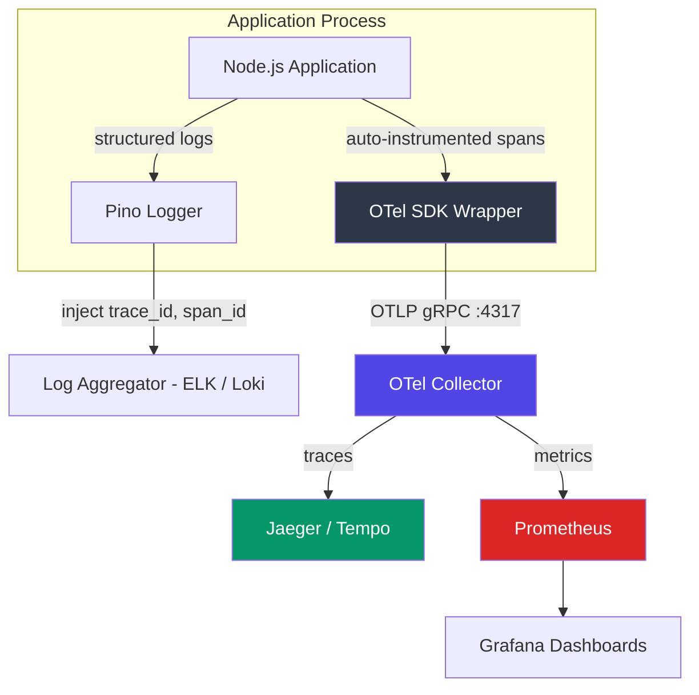

# OpenTelemetry SDK Node

A production-ready OpenTelemetry wrapper for Node.js that provides distributed tracing (OTLP/gRPC), structured logging with trace correlation (Pino), and Prometheus-compatible metrics export -- with zero-code auto-instrumentation.

## Problem

Microservices make debugging distributed failures nearly impossible without correlated observability. A single user request may span 5+ services, and without trace propagation, engineers are left grepping logs across containers hoping timestamps align.

This SDK initializes OpenTelemetry once at process boot, auto-instruments all HTTP/database/queue interactions, and injects `trace_id` and `span_id` into every structured log line -- enabling a single trace ID to reconstruct the full request lifecycle across services.

## Architecture



**Key architectural decisions:**
- **Boot-time initialization**: `initializeTelemetry()` runs before any imports to ensure auto-instrumentation patches are applied before modules are loaded. Order matters -- late initialization misses spans.
- **Trace-log correlation**: Pino's `formatters.log` hook extracts the active span context and injects `trace_id`/`span_id` into every log entry. This enables clicking from a Jaeger trace directly to correlated log lines in ELK/Loki.
- **Graceful shutdown**: `SIGTERM` handler calls `sdk.shutdown()` to flush all pending spans and metrics before process exit, preventing data loss during deployments.

## Tech Stack

| Technology | Why |
|---|---|
| **@opentelemetry/sdk-node** | Official Node.js SDK with auto-instrumentation for Express, HTTP, MongoDB, Redis, pg, and 30+ libraries out of the box. |
| **OTLP gRPC exporters** | Binary protocol with connection multiplexing. Lower overhead than HTTP/JSON for high-throughput services. |
| **Pino** | Fastest Node.js structured logger (~30K logs/s). JSON output is directly ingestible by ELK/Loki without parsing. |
| **pino-http** | Express middleware that auto-creates a child logger per request with `req.id`, status code, and response time. |
| **OTel Collector** | Vendor-agnostic pipeline: receives OTLP, batches, and exports to Jaeger/Tempo/Datadog/etc. Decouples app from backend. |

## Key Features

- **Zero-code auto-instrumentation** -- Express, HTTP, MongoDB, Redis, pg, and more instrumented automatically at boot
- **Trace-log correlation** -- every Pino log line includes `trace_id` and `span_id` from the active OpenTelemetry context
- **Custom span creation** -- `tracer.startActiveSpan()` for wrapping business logic with named spans and custom attributes
- **Periodic metric export** -- metrics flushed every 10s to OTLP collector for Prometheus scraping
- **Graceful shutdown** -- `SIGTERM` flushes all pending telemetry before process exit
- **Environment-aware logging** -- pretty-printed in development, raw JSON in production

## Trace-Log Correlation Example

```json
{
  "level": 30,
  "time": 1711459200000,
  "msg": "Processing work inside span...",
  "trace_id": "a1b2c3d4e5f6a1b2c3d4e5f6a1b2c3d4",
  "span_id": "1234567890abcdef",
  "trace_flags": 1
}
```

This log line can be found in ELK/Loki by searching `trace_id`, then correlated with the full distributed trace in Jaeger/Tempo.

## Scale Considerations

| Dimension | Current | Production Path |
|---|---|---|
| **Sampling** | 100% (all spans exported) | Add tail-based sampling in OTel Collector for high-throughput services |
| **Collector topology** | Single container | Deploy as DaemonSet (K8s) or sidecar for HA and reduced network hops |
| **Metric cardinality** | Low (default auto-instrumentation) | Add custom metrics with bounded label sets to avoid Prometheus cardinality explosion |
| **Log volume** | All levels | Set `LOG_LEVEL=warn` in production; use sampling for info-level in high-RPS services |

## Setup

```bash
# Start OTel Collector
docker-compose up -d

# Install dependencies
npm install

# Run instrumented API
npm run dev
```

```bash
# Generate traces
curl http://localhost:3000/
# Check OTel Collector logs for exported spans
docker-compose logs otel-collector
```

## Integration With Other Projects

This SDK is designed to be dropped into any Node.js service. Integrating with [distributed-queue-engine](https://github.com/sudhanshu1402/distributed-queue-engine) would provide end-to-end traces spanning: API request -> queue enqueue -> worker processing -> downstream SMTP call.

## Future Improvements

- [ ] Publish as private npm package for cross-service reuse
- [ ] Tail-based sampling configuration for production workloads
- [ ] Baggage propagation for cross-service context (tenant ID, feature flags)
- [ ] Custom Prometheus counters for business metrics (jobs processed, emails sent)
- [ ] Grafana dashboard templates for common service health views

## Deep-Dive Architecture

For a complete system design breakdown with Mermaid diagrams, visit the [System Design Portal](https://sudhanshu1402.github.io/system-design-portal/tracing-sdk).

## License

MIT
