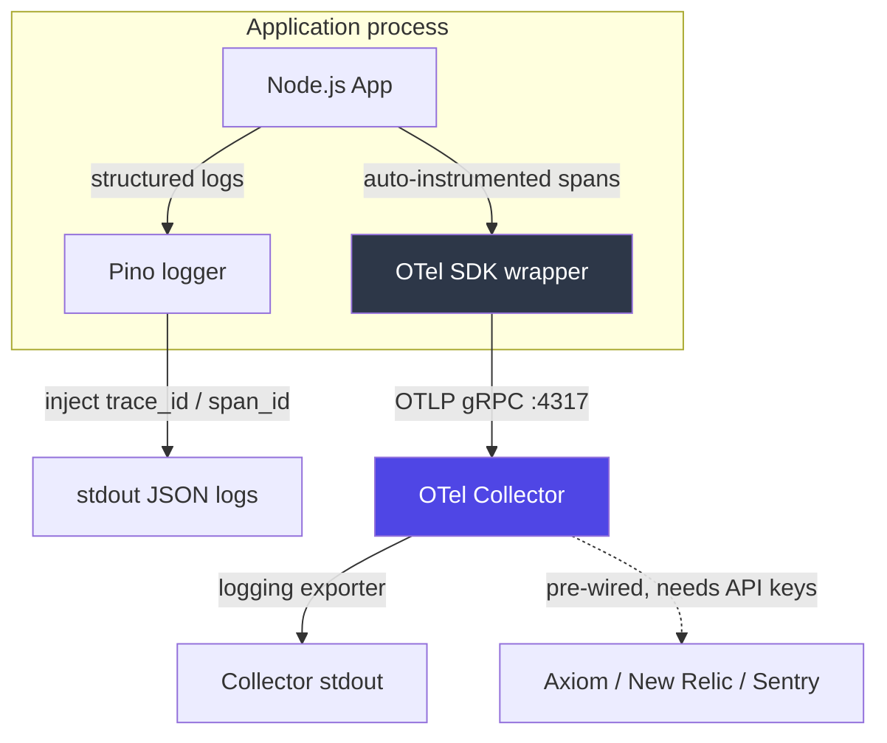

# OpenTelemetry SDK Node

[](https://github.com/sudhanshu1402/otel-sdk-node/actions/workflows/ci.yml) [](LICENSE)

A batteries-included OpenTelemetry setup for Node.js: distributed tracing over OTLP/gRPC, trace-correlated structured logging with Pino, and periodic metric export -- with zero-code auto-instrumentation. Ships with a small Express app that exercises it.

> **Scope:** a thin configuration layer over the official `@opentelemetry/sdk-node`, plus a demo API that shows it working. The value is the *wiring* -- boot order so instrumentation patches apply before any import, trace/log correlation, and a clean flush on shutdown -- not a reimplementation of OpenTelemetry.

## Problem

A single request across microservices may touch five or more services. Without trace propagation and correlated logs, debugging a distributed failure means grepping logs across containers and hoping timestamps line up.

This project initializes OpenTelemetry once at process boot, auto-instruments HTTP/DB/queue calls, and injects `trace_id` and `span_id` into every structured log line. One trace ID then reconstructs the full request path, and any log line links back to the span it happened in.

## Architecture



**What's actually wired today:** the app exports traces and metrics to a local OpenTelemetry Collector over OTLP/gRPC on port 4317. The collector's active pipelines send everything to its `logging` exporter (stdout), so you can see spans and metrics in `docker-compose logs`. Exporters for Axiom, New Relic, and Sentry are defined in `otel-collector-config.yaml` but not in the active pipelines -- drop in the API keys and add them to a pipeline to ship telemetry to a real backend.

**Decisions worth calling out:**
- **Boot-time init.** `initializeTelemetry()` runs at the very top of `src/index.ts`, before Express or any instrumented library is imported. Auto-instrumentation works by patching modules on `require`, so anything imported before `sdk.start()` never gets patched and its spans go missing.
- **Trace/log correlation.** Pino's `formatters.log` hook reads the active span context and adds `trace_id` / `span_id` / `trace_flags` to every log object. The extraction is a pure function (`withTraceContext` in `src/trace-format.ts`) so it can be unit-tested without a live SDK.
- **Clean shutdown.** Both `SIGTERM` (orchestrator stop) and `SIGINT` (local Ctrl-C) call `sdk.shutdown()` to flush buffered spans and metrics before exit, so the last batch isn't dropped on deploy.

## Tech stack

| Piece | Role |
|---|---|
| `@opentelemetry/sdk-node` | Official Node SDK; `getNodeAutoInstrumentations()` patches Express, HTTP, and 30+ libraries automatically. |
| OTLP/gRPC exporters | Send traces and metrics to the collector. Binary protocol, lower overhead than HTTP/JSON. |
| Pino + pino-http | Fast JSON logger; `pino-http` gives a per-request child logger with request id, status, and duration. |
| OpenTelemetry Collector | Vendor-agnostic pipeline. Receives OTLP, batches, exports. Decouples the app from any backend. |
| Express 5 | The demo API. |
| swagger-ui-express | Serves the OpenAPI doc at `/api-docs`. |
| Vitest | Unit tests for the log formatter and the OpenAPI/route contract. |

## Endpoints

| Route | What it does |
|---|---|
| `GET /` | Opens a custom span (`process-root-request`), sets an attribute, waits 100ms, logs inside the span, records an event, returns a greeting. |
| `GET /ping` | Health check that echoes the active `traceId` so a probe can be correlated with its trace. |
| `GET /error` | Logs at error level and returns HTTP 500 -- useful for exercising error handling. |
| `GET /api-docs` | Swagger UI for the OpenAPI definition in `src/swagger.ts`. |

## Trace/log correlation example

A log line emitted inside an active span:

```json
{
  "level": 30,
  "time": 1711459200000,
  "msg": "Processing work inside span...",
  "trace_id": "a1b2c3d4e5f6a1b2c3d4e5f6a1b2c3d4",
  "span_id": "1234567890abcdef",
  "trace_flags": 1
}
```

Search a log backend by `trace_id`, then jump to the full trace in a tracing backend. In development the logs are pretty-printed via `pino-pretty`; in production (`NODE_ENV=production`) they're raw JSON.

## Setup

```bash
# Start the collector
docker-compose up -d

# Install deps
npm install

# Run the instrumented API (ts-node + nodemon)
npm run dev
```

```bash
# Generate a trace
curl http://localhost:3000/

# See exported spans/metrics in the collector's stdout
docker-compose logs otel-collector
```

Config is via environment variables (see `.env.example`):

| Variable | Default | Purpose |
|---|---|---|
| `OTEL_EXPORTER_OTLP_ENDPOINT` | `http://localhost:4317` | Collector OTLP/gRPC endpoint. |
| `OTEL_SERVICE_NAME` | `otel-sdk-node` | Service name stamped on every span/metric. |
| `OTEL_SERVICE_VERSION` | `1.0.0` | Service version resource attribute. |
| `LOG_LEVEL` | `info` | Pino log level. |
| `NODE_ENV` | — | `production` switches logs to raw JSON. |
| `PORT` | `3000` | HTTP port. |

## Build and test

```bash
npm run build   # tsc -> dist/
npm start       # node dist/index.js
npm test        # vitest run
```

Two test files (run in CI on Node 20 and 22):
- `tests/trace-format.test.ts` -- covers `withTraceContext`: no-active-span passthrough, id injection, immutability, zero/empty-string ids, and overwrite of stale trace fields.
- `tests/swagger.test.ts` -- pins the OpenAPI shape to the routes actually served, so documenting a nonexistent endpoint (or forgetting one) fails the build.

## Deploy

- **Docker:** multi-stage `Dockerfile` builds with `npm ci`, ships only production deps, runs as the non-root `node` user, exposes 3000.
- **Render:** `render.yaml` defines a web service (`npm install --include=dev && npm run build`, then `npm start`).

## Scale considerations

| Dimension | Current | Production path |
|---|---|---|
| Sampling | 100% of spans exported | Tail-based sampling in the collector for high-throughput services. |
| Collector topology | Single container | DaemonSet (K8s) or sidecar for HA and fewer network hops. |
| Metric cardinality | Low (default auto-instrumentation) | Bound label sets on custom metrics to avoid cardinality blowups. |
| Log volume | All levels | `LOG_LEVEL=warn` in production; sample info-level in high-RPS paths. |

## Future improvements

- [ ] Publish as a private npm package for cross-service reuse
- [ ] Tail-based sampling config for production
- [ ] Baggage propagation for cross-service context (tenant id, feature flags)
- [ ] Custom counters for business metrics (jobs processed, emails sent)
- [ ] Grafana dashboard templates

## Related

Designed to drop into any Node service. Wiring it into [distributed-queue-engine](https://github.com/sudhanshu1402/distributed-queue-engine) would give end-to-end traces spanning API request -> queue enqueue -> worker -> downstream call. A deeper design write-up lives on the [System Design Portal](https://sudhanshu1402.github.io/system-design-portal/tracing-sdk).

## License

MIT
