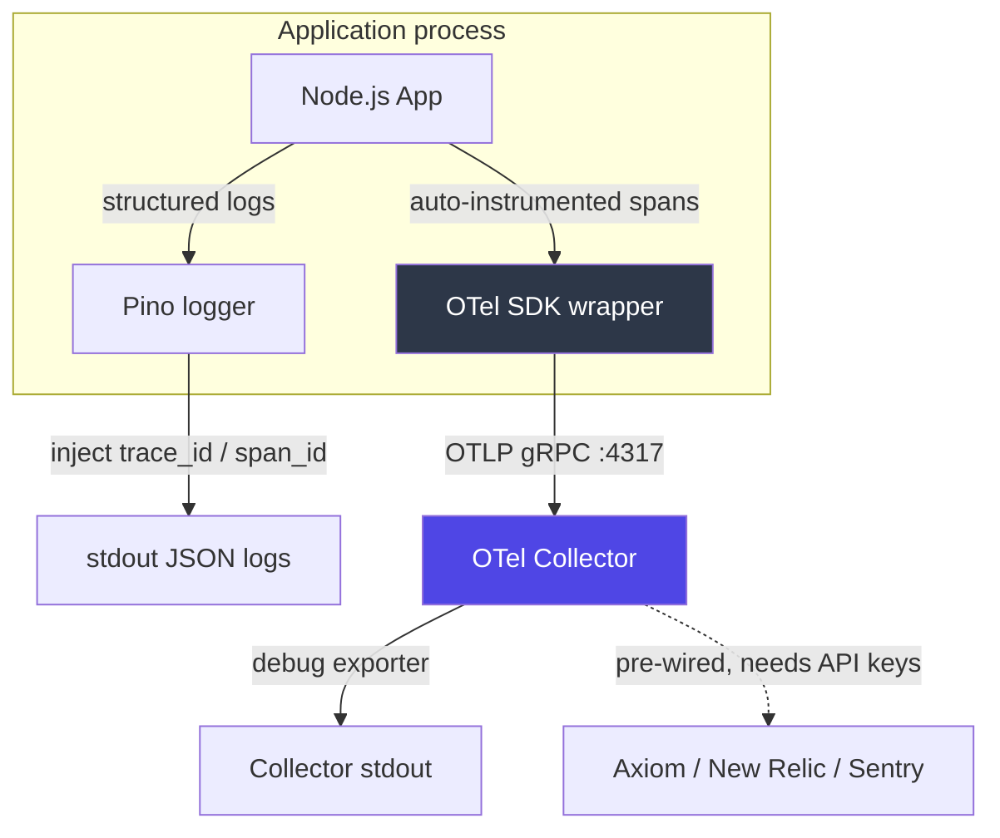

<h1>
<picture>
  <source media="(prefers-color-scheme: dark)" srcset="https://raw.githubusercontent.com/sudhanshu1402/otel-sdk-node/main/assets/banner-dark.svg" />
  <source media="(prefers-color-scheme: light)" srcset="https://raw.githubusercontent.com/sudhanshu1402/otel-sdk-node/main/assets/banner-light.svg" />
  
</picture>
</h1>

[](https://github.com/sudhanshu1402/otel-sdk-node/actions/workflows/ci.yml) [](LICENSE)

OpenTelemetry wiring for Node services: OTLP/gRPC traces, Pino logs stamped with the trace they happened in, periodic metrics, and a shutdown that actually flushes. Ships with a small Express app that exercises all of it.

It's a thin configuration layer over the official `@opentelemetry/sdk-node`, not a reimplementation. The value is the wiring, which is the part that's easy to get subtly wrong.

## The problem

One request crosses five services. Without trace propagation and correlated logs, debugging it means grepping containers and hoping timestamps line up.

This initializes OpenTelemetry at process boot, auto-instruments HTTP/DB/queue calls, and injects `trace_id` and `span_id` into every log line. One trace ID reconstructs the whole request path, and any log line links back to its span.

## Architecture


```mermaid
graph TB
    App[Node.js App] -->|auto-instrumented spans| SDK[OTel SDK wrapper]
    App -->|structured logs| Logger[Pino logger]
    Logger -->|inject trace_id / span_id| Out[stdout JSON logs]
    SDK -->|OTLP gRPC :4317| Collector[OTel Collector]
    Collector -->|debug exporter| Stdout[Collector stdout]
    Collector -.->|pre-wired, needs API keys| Vendors[Axiom / New Relic / Sentry]

    subgraph "Application process"
        App
        SDK
        Logger
    end

    style SDK fill:#2d3748,color:#fff
    style Collector fill:#4f46e5,color:#fff
```

## Three decisions worth reading

**Boot order.** `initializeTelemetry()` runs at the very top of `src/index.ts`, before Express or anything instrumented gets imported. Auto-instrumentation patches modules on `require`, so anything imported before `sdk.start()` is never patched and its spans silently vanish. This is the bug people spend an afternoon on.

**Correlation is a pure function.** Pino's `formatters.log` hook reads the active span context and adds `trace_id`, `span_id`, and `trace_flags` to every log object. The extraction lives in `withTraceContext` (`src/trace-format.ts`) so it's unit-testable without a live SDK.

**Shutdown flushes.** `SIGTERM` and `SIGINT` both call `sdk.shutdown()`, so the last batch of spans survives a deploy instead of dying with the process.

## Run it

```bash
docker-compose up -d     # collector on :4317
npm install
npm run dev
```

```bash
curl http://localhost:3000/
docker-compose logs otel-collector    # spans and metrics land here
```

Routes: `/` opens a custom span, `/ping` echoes the active trace ID, `/error` returns a 500, `/api-docs` serves Swagger UI. Config is environment variables, listed in `.env.example`.

A log line emitted inside a span:

```json
{ "level": 30, "msg": "Processing work inside span...",
  "trace_id": "a1b2c3d4e5f6a1b2c3d4e5f6a1b2c3d4",
  "span_id": "1234567890abcdef", "trace_flags": 1 }
```

## Tests

```bash
npm test
```

`tests/trace-format.test.ts` covers `withTraceContext`: passthrough with no active span, id injection, immutability, empty ids, and overwriting stale trace fields. `tests/swagger.test.ts` pins the OpenAPI doc to the routes actually served, so documenting an endpoint that doesn't exist fails the build. `tests/telemetry.test.ts` reads the resource back off the constructed SDK and asserts `telemetry.sdk.*` survives alongside `service.name`, which is the thing SDK 2.x drops silently if you hand it a bare resource. CI runs all three on Node 20 and 22.

## What it doesn't do

- Exports 100% of spans. Real throughput needs tail-based sampling in the collector.
- One collector container. No HA, no DaemonSet or sidecar topology.
- Axiom, New Relic, and Sentry exporters exist in `otel-collector-config.yaml` but aren't in the active pipelines. Add keys and a pipeline to ship somewhere real.
- No baggage propagation, so tenant id and feature flags don't cross service boundaries yet.

## Related

Drops into any Node service. Wiring it into [distributed-queue-engine](https://github.com/sudhanshu1402/distributed-queue-engine) gives end-to-end traces from API request through enqueue to worker. Longer write-up on the [System Design Portal](https://sudhanshu1402.github.io/system-design-portal/tracing-sdk).

## License

MIT
