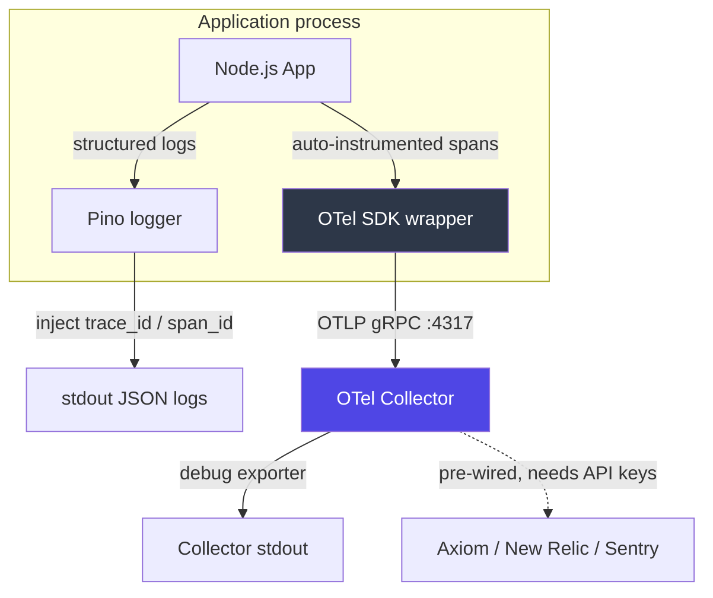

<h1>
<picture>
  <source media="(prefers-color-scheme: dark)" srcset="https://raw.githubusercontent.com/sudhanshu1402/otel-sdk-node/main/assets/banner-dark.svg" />
  <source media="(prefers-color-scheme: light)" srcset="https://raw.githubusercontent.com/sudhanshu1402/otel-sdk-node/main/assets/banner-light.svg" />
  
</picture>
</h1>

[](https://github.com/sudhanshu1402/otel-sdk-node/actions/workflows/ci.yml) [](LICENSE)


OpenTelemetry wiring for Node services: OTLP/gRPC traces, Pino logs stamped with the trace they happened in, periodic metrics, and a shutdown that actually flushes. Ships with a small Express app that exercises all of it.

It's a thin configuration layer over the official `@opentelemetry/sdk-node`, not a reimplementation. The value is the wiring, which is the part that's easy to get subtly wrong.

## The problem

One request crosses five services. Without trace propagation and correlated logs, debugging it means grepping containers and hoping timestamps line up.

This initializes OpenTelemetry at process boot, auto-instruments HTTP/DB/queue calls, and injects `trace_id` and `span_id` into every log line. One trace ID reconstructs the whole request path, and any log line links back to its span.

## Architecture


```mermaid
graph TB
    App[Node.js App] -->|auto-instrumented spans| SDK[OTel SDK wrapper]
    App -->|structured logs| Logger[Pino logger]
    Logger -->|inject trace_id / span_id| Out[stdout JSON logs]
    SDK -->|OTLP gRPC :4317| Collector[OTel Collector]
    Collector -->|debug exporter| Stdout[Collector stdout]
    Collector -.->|pre-wired, needs API keys| Vendors[Axiom / New Relic / Sentry]

    subgraph "Application process"
        App
        SDK
        Logger
    end

    style SDK fill:#2d3748,color:#fff
    style Collector fill:#4f46e5,color:#fff
```

## Three decisions worth reading

Boot order, why correlation is a pure function, and how shutdown avoids hanging on a dead collector: [docs/DECISIONS.md](docs/DECISIONS.md).

## Run it

```bash
docker-compose up -d     # collector on :4317
npm install
npm run dev
```

```bash
curl http://localhost:3000/
docker-compose logs otel-collector    # spans and metrics land here
```

Routes: `/` opens a custom span, `/ping` echoes the active trace ID, `/error` returns a 500, `/api-docs` serves Swagger UI. Config is environment variables, listed in `.env.example`.

## Proof it runs


Both blocks above are captured output, not typed text: `npm run assets` runs `scripts/demo-correlation.ts` and the suite, then writes back what those two commands printed. Run the same command yourself and you get the same lines. No collector or network needed for either.

## Tests

```bash
npm test
```

23 tests across three files: the correlation formatter, the OpenAPI doc pinned to the routes actually served, and the SDK resource attributes. Breakdown in [docs/DECISIONS.md](docs/DECISIONS.md). CI runs all three on Node 20 and 22.

## What it doesn't do

- Exports 100% of spans. Real throughput needs tail-based sampling in the collector.
- One collector container. No HA, no DaemonSet or sidecar topology.
- Axiom, New Relic, and Sentry exporters exist in `otel-collector-config.yaml` but aren't in the active pipelines. Add keys and a pipeline to ship somewhere real.
- No baggage propagation, so tenant id and feature flags don't cross service boundaries yet.

## Related

Drops into any Node service. Wiring it into [distributed-queue-engine](https://github.com/sudhanshu1402/distributed-queue-engine) gives end-to-end traces from API request through enqueue to worker. Longer write-up on the [System Design Portal](https://sudhanshu1402.github.io/system-design-portal/tracing-sdk).

## License

MIT
